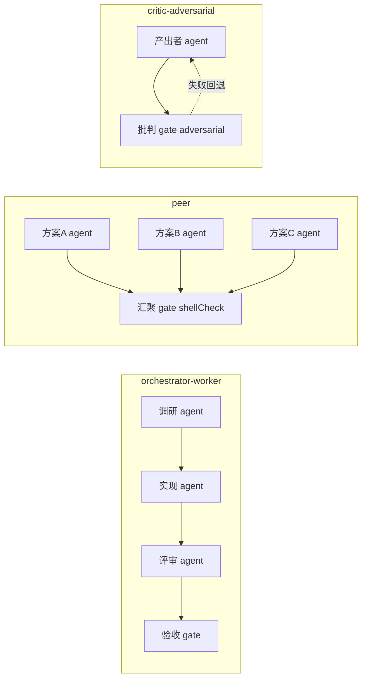

# 技术方案：DeepThink 多人协作工作能力建设

> 关联 PRD：`docs/prd/multi-user-collaboration/PRD.md`
> 分支：`feat/multi-user-collaboration`
> 状态：v1
> 日期：2026-09-01

## 0. 设计总则

**核心判断**：本功能不是新引擎，而是 team-builder + graph-engineering + 共享工作区底座之上的**协作模式层 + 共享产物层**。复用 `GraphDefinition` 作为数据模型、复用 `graph-orchestrator`/`graph-runner` 执行、复用 `team-builder` 的 decompose/createMemberAgent/register/start 主干、复用 `group_members`+folder 级共享做多人共享。新增仅：① `collaborations` 表 ② `mode`/`scenario` 输入字段 + team-prompt 模式分支 ③ `assembleGraphDefinition` 模式拓扑分支 ④ 共享产物持久化 + 协作记忆路由 ⑤ `/api/collaborations/*` 薄路由 ⑥ `CollaborationPage` 前端。

**Surgical Changes**：不改动 `graph-scheduler`/`graph-orchestrator`/`graph-runner` 核心；不改动 `team-builder` 默认行为（mode 缺省 = orchestrator-worker 等价旧行为）；不改动 `TeamPage`/`/api/team/*`/`team_builds` 表；不改动 `isUserOwnedFolder` 安全边界。

## 1. 架构总览

```
┌──────────────────────────────────────────────────────────────┐
│ 前端 CollaborationPage (React)                                │
│  目标输入 + 模式三选一 + 场景预设 + 共享工作区选择 + 高级选项  │
│  执行态: GraphDagView + AgentConversationPanel (复用)         │
│  ↑ /api/collaborations/* (CRUD/轮询/产物/记忆)                │
├──────────────────────────────────────────────────────────────┤
│ 路由层 src/routes/collaborations.ts (Hono, authMiddleware)     │
│  POST(异步) / GET:list / GET:id(轮询) / GET deliverables /    │
│  GET+POST memory                                              │
├──────────────────────────────────────────────────────────────┤
│ collaboration-builder.ts (复用 team-builder 主干)             │
│  decompose(mode 分支 prompt) → createMemberAgent(复用) →      │
│  assembleCollaborationGraph(mode 分支拓扑) →                  │
│  registerDefinition + startGraphRun + executeGraph (复用)     │
│  + post-completion 持久化共享产物                             │
├──────────────────────────────────────────────────────────────┤
│ 复用: team-prompt(扩展分支) / team-plan(mode 字段) /          │
│       graph-registry / graph-orchestrator / graph-runner      │
├──────────────────────────────────────────────────────────────┤
│ SQLite: collaborations 表 (schema 58→59)                       │
│ 共享产物: data/groups/{folder}/collaborations/{collabId}/     │
│   peer/  deliverables/  shared-memory.md  final-deliverable.md │
└──────────────────────────────────────────────────────────────┘
```

## 2. 数据模型（schema v58→v59，仅加表）

### 2.1 新增 `collaborations` 表
```sql
CREATE TABLE IF NOT EXISTS collaborations (
  id TEXT PRIMARY KEY,
  owner_user_id TEXT NOT NULL,
  group_folder TEXT NOT NULL,
  chat_jid TEXT NOT NULL,
  goal_text TEXT NOT NULL,
  mode TEXT NOT NULL CHECK(mode IN ('orchestrator-worker','peer','critic-adversarial')),
  scenario TEXT,
  background TEXT,
  acceptance_criteria TEXT,
  status TEXT NOT NULL DEFAULT 'running'
    CHECK(status IN ('running','completed','failed')),
  plan_json TEXT,
  run_id TEXT,
  definition_id TEXT,
  participants_json TEXT,
  error TEXT,
  created_at INTEGER NOT NULL,
  updated_at INTEGER NOT NULL
);
CREATE INDEX IF NOT EXISTS idx_collaborations_owner ON collaborations(owner_user_id, created_at DESC);
```
- `db.ts` SCHEMA_VERSION `'58'` → `'59'`，迁移块新增建表 + index。
- 新增 db 函数：`createCollaboration` / `getCollaboration` / `completeCollaboration` / `failCollaboration` / `listCollaborations(userId, limit)`。签名镜像 `team_builds` 的同名函数（最小认知负担）。

### 2.2 `TeamTaskInput` 扩展（`team-plan.ts`）
```ts
export interface TeamTaskInput {
  // ...既有字段...
  /** 协作模式（collaborations 模块）。缺省 'orchestrator-worker'（= 既有行为，向后兼容）。 */
  mode?: 'orchestrator-worker' | 'peer' | 'critic-adversarial';
  /** 场景预设 id（software-engineering/brainstorm/philosophy-critique），仅用于 prompt 上下文。 */
  scenario?: string;
  /** 协作 id（由 collaboration-builder 注入，用于 peer 模式产物文件路径）。 */
  collaborationId?: string;
}
```
不改 `TeamPlanSchema`（LLM 产物 schema 不变，mode 是输入驱动）。

## 3. 模块改动详述

### 3.1 `team-prompt.ts`：模式分支分解 prompt
新增 `buildDecompositionPromptByMode(input)` 调度器，按 `input.mode` 分支：
- `orchestrator-worker`（或缺省）：调既有 `buildDecompositionPrompt(input)`，零改。
- `peer`：新模板——「你是组织者。把任务拆为 N 个对等角色，各产出**不同视角**方案，**并行无依赖**，各自把方案写入文件 `collaborations/{collabId}/peer/{member-name}.md`；末尾 gate 校验全部方案文件齐备」。示例 JSON 示意 N agent 节点 `dependsOn:[]` + 终端 gate `dependsOn` 全部 N + `shellCheck`。
- `critic-adversarial`：新模板——「拆为产出者 + 末尾批判 gate：批判者主动找漏洞/反例/逻辑谬误，strict assertions；不通过则产出者带反馈重做」。示例 JSON 示意 producer agent → critic gate (`upstreamNodeId`=producer, adversarial `assertions`)。
- scenario 预设：`SCENARIO_PRESETS` 常量（software-engineering/brainstorm/philosophy-critique 三套 goalText+acceptanceCriteria 模板），`applyScenario(input)` 在组建前填充。

`buildGoalAnchor` 不改（已有，复用）。`buildFallbackPlan` 扩展按 mode 生成对应 fallback 拓扑（peer: 2 并行 agent + gate；critic: producer + critic gate）。

### 3.2 `team-builder.ts`：模式拓扑分支
`assembleGraphDefinition` 顶部按 `input.mode` 分支：
- `orchestrator-worker`（或缺省）：走既有组装逻辑（串行 + 末尾行为证据 gate + semi-auto 插入），**零改**。
- `peer`：
  1. 对每个 agent 成员节点：`dependsOn:[]`（并行），`prompt` = `buildGoalAnchor(...) + '\n\n【交付方式】请将你的完整方案写入文件：collaborations/{collabId}/peer/{member-name}.md（相对工作区根），并在对话中给出摘要。'`。
  2. 终端 gate：`dependsOn` = 全部 agent 节点 id；`shellCheck` = `cd <group_folder> && for m in {member1} {member2} ...; do test -f "collaborations/{collabId}/peer/$m.md" || exit 1; done`；`successCriteria` = `综合评审各对等方案视角差异性与完整性`；`upstreamNodeId` = 首个 agent。
- `critic-adversarial`：
  1. producer agent 节点（`dependsOn:[]`）。
  2. critic gate：`dependsOn:[producer]`，`upstreamNodeId`=`producer`，`successCriteria` = `批判性审查：找出产出的逻辑谬误/反例/未覆盖情形；只有当产出经得起严格批判且无致命缺陷时通过`，`assertions` = `[{kind:'contains', value:'修订'} 或 {kind:'regex', value:'(回应|修订|反驳)'}`（要求产出含修订痕迹，证明经批判后修订过）。
  3. 不再追加既有「acceptance gate backstop」（critic gate 即验收）。

### 3.3 `collaboration-builder.ts`（新文件）
```ts
export async function buildCollaboration(input, deps): Promise<CollabResult | CollabError> {
  // 1. applyScenario（scenario 预设填充 goalText/acceptanceCriteria）
  // 2. decompose（mode 分支 prompt）→ parseTeamPlan → fallback
  // 3. applyAdvancedOptions（复用 team-builder 的 maxTeamSize/toolset 逻辑——抽为共享函数或复刻）
  // 4. createMemberAgent（复用 team-builder 的 createMemberAgent——导出它）
  // 5. assembleCollaborationGraph（mode 分支拓扑——即 3.2 的扩展 assembleGraphDefinition）
  // 6. registerDefinition + startGraphRun + executeGraph（复用）
  // 7. createCollaboration 表记录 + 共享产物目录
  // 8. fire-and-forget post-completion: 轮询 run 终态后 persistSharedArtifacts
}
```
**复用策略**：把 `team-builder.ts` 的 `createMemberAgent`、`applyAdvancedOptions`、`assembleGraphDefinition`（扩展 mode 分支后）导出，`collaboration-builder` 复用，不复制。`assembleGraphDefinition` 顶部加 `if (input.mode === 'peer') return assemblePeerGraph(...)` 等分支，orchestrator-worker 缺省走原逻辑。

### 3.4 共享产物持久化
```ts
function persistSharedArtifacts(collabId, groupFolder, runId): void {
  // 读 graph_node_runs where graph_run_id=runId（含 output_summary / node_type）
  // 写 collaborations/{collabId}/deliverables/{nodeId}.md
  // 写 manifest.json: [{nodeId, member, role, title, file}]
  // terminal 节点产出 → final-deliverable.md
}
```
节点产出来源：`graph_node_runs.output_summary`（既有列，graph-runner 写入 `node_<id>_output` 的前 4000 字符）。terminal 节点 = 无下游的 agent/gate 节点。

### 3.5 路由 `routes/collaborations.ts`
```
POST /api/collaborations            — 立即返 collabId，后台 detached buildCollaboration
GET  /api/collaborations            — list 当前用户协作历史
GET  /api/collaborations/:id        — 轮询：running/completed(+plan+runId)/failed(+error)
GET  /api/collaborations/:id/deliverables         — 列 manifest
GET  /api/collaborations/:id/deliverables/:nodeId — 读单个产物
GET  /api/collaborations/:id/memory  — 读 shared-memory.md
POST /api/collaborations/:id/memory  — 追加 shared-memory.md（body{text}）
```
权限：`authMiddleware` + owner 校验 **或** `canAccessGroup(authUser, group)`（群成员可访问，与既有 group 路由一致）。非 owner 且非群成员 → 404。

post-completion 触发：`GET /:id` 检测到 run completed 且 deliverables 未持久化时，同步持久化一次（幂等）——避免另起后台轮询进程。或 buildCollaboration 的 fire-and-forget promise 在 run 完成回调里持久化。P0 选后者（buildCollaboration 内 `executeGraph().then(()=>persistSharedArtifacts())`）。

### 3.6 前端 `CollaborationPage.tsx` + `stores/collaborations.ts`
- store 镜像 `stores/team.ts`（POST 拿 id → 轮询 GET/:id 拿终态）。
- 页面参考 `TeamPage.tsx` split：左侧目标输入+模式选择+场景预设+工作区选择+历史；执行态复用 `ResizableSplitter` + `AgentConversationPanel` + `GraphDagView`。
- 模式三选一卡片（单选）；场景预设下拉（选后 setGoal/setCriteria）。
- 侧栏入口：`App.tsx` 路由加 `/collaborations` + `Sidebar` 加菜单项。

## 4. 三模式拓扑示例（Mermaid）



## 5. 向后兼容与不回归
- `mode` 缺省 = `'orchestrator-worker'`：`assembleGraphDefinition` mode 缺省分支 = 既有逻辑，`buildDecompositionPromptByMode` 缺省 = 既有 `buildDecompositionPrompt`。既有 `TeamPage`/`/api/team/*` 不传 mode，行为不变。
- `team_builds` 表不动；既有 team 路由不动。
- `graph-engineering` 核心零改。
- 全量 vitest（含 super-agent-team-* 系列）须绿。

## 6. 验证手段
- 后端 typecheck：`cd ~/deepthink/.worktrees/feat-multi-user-collaboration && npx tsc --noEmit`（worktree 临时装 typescript@5.9.3 + @types/node@22，`--no-save`，结束 `git checkout -- node_modules` 恢复符号链接）。
- 前端 typecheck + build：`ln -s /home/me/deepthink/web/node_modules web/node_modules && cd web && npx tsc --noEmit && npx vite build`。
- 单测：`npx vitest run tests/units/collaborations.test.ts` + 全量 `npx vitest run`。
- 运行态集成：登录 http://127.0.0.1:9999（admin/88888888），curl 三场景 `/api/collaborations`，轮询终态，校验共享产物。
